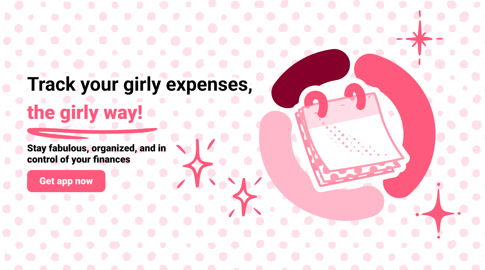

<div align="center">
  <br />
    <a href="https://girl-math.vercel.app" target="_blank">
      
    </a>  <br />

  <h1 align="center">Girly Expanses Tracker</h1><div>
    
    
        
    
  </div>
   <div align="center">
     🌸Experience the magic of smart money management with our Girl Math app. Transform the way you track, manage, and achieve your financial goals with a touch of elegance, style, and fun!🌸
    </div>
</div>

## 📋 <a name="table">Table of Contents</a>

1. 🤖 [Introduction](#introduction)
2. ⚙️ [Tech Stack](#tech-stack)
3. 🔋 [Features](#features)
4. 🤸 [Quick Start](#quick-start)

## <a name="introduction">🤖 Introduction</a>

This application aims to revolutionize the way individuals manage and monitor their finances by offering a user-friendly and visually captivating platform. Tailored with a feminine aesthetic, the Girl Math app provides an engaging and delightful experience for users to track expenses, set budgets, and achieve financial goals with flair.

## <a name="tech-stack">⚙️ Tech Stack</a>

- React.js
- Tailwind CSS
- Next.js
- Firebase
- Chart.js

## <a name="features">🔋 Features</a>

👉 **Intuitive Dashboard**:
A vibrant and colorful dashboard that displays a summary of monthly expenses, income, and current balance. Leveraging React.js and Next.js, the dashboard offers a smooth and engaging user experience with interactive charts and graphs powered by Chart.js.

👉 **Chic Expense Categories**:
Pre-defined and customizable categories with cute and girly icons, such as shopping, beauty, dining, and entertainment. The categories are stored and managed efficiently using Firebase, ensuring seamless integration and flexibility.

👉 **Effortless Transaction Recording**:
A simple interface to input daily expenses and income with options to add notes and categorize transactions. Developed using React.js and Next.js, the transaction recording system incorporates form validation and data storage techniques for optimal usability and organization.

👉 **Comprehensive Reports and Insights**:
Detailed monthly financial reports with breakdowns of expenses by category. Integrated analytics features utilize data aggregation and visualization tools to generate comprehensive financial reports and insights, enhancing financial literacy and money management skills.

👉 **Security Features**:
Utilizing the latest Google security techniques and industry-standard security practices, the app ensures the confidentiality and privacy of user data. Google account-based authentication provides an additional layer of security, offering peace of mind to users and safeguarding their personal information.

## <a name="quick-start">🤸 Quick Start</a>

Follow these steps to set up the project locally on your machine.

**Prerequisites**

Make sure you have the following installed on your machine:

- [Git](https://git-scm.com/)
- [Node.js](https://nodejs.org/en)
- [npm](https://www.npmjs.com/) (Node Package Manager)

**Cloning the Repository**

```bash
git clone https://github.com/maxbezs/girl-math.git
cd girl-math
```

**Installation**

Install the project dependencies using npm:

```bash
npm install
```

**Running the Project**

```bash
npm run dev
```

Open [http://localhost:3000](http://localhost:3000) in your browser to view the project.

---
